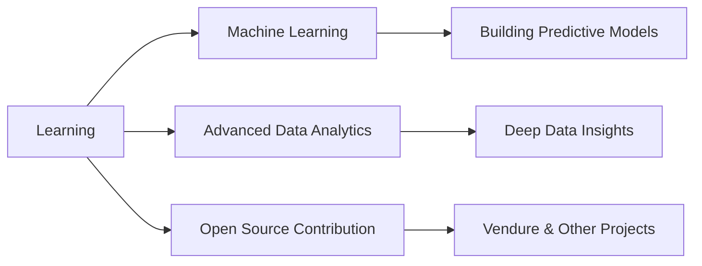

Here's your **complete professional README** with a cleaner, more elegant header section. I've replaced the typing animation with a sophisticated ASCII name header and removed the "Hijabi in Tech" badge since you preferred it elsewhere.

---

## 📋 Complete README Code (Copy & Paste Entirely)

```markdown
<div align="center">
  
# ✧ REHANA HASSAN ✧

### Software Engineer & Data Analyst

*Magna Cum Laude (3.86 GPA) | Hackathon Winner 2024*

[](https://github.com/rihhanna)

</div>

---

## 👩‍💻 About Me

I'm a **Software Engineer & Data Analyst** who transforms complex data into actionable insights and clean code into powerful solutions. My work bridges the gap between software development and data analytics, creating applications that are both functional and insightful.

```python
class Rehana:
    def __init__(self):
        self.role = "Software Engineer & Data Analyst"
        self.achievements = ["Hackathon Winner 2024", "Magna Cum Laude (3.86 GPA)"]
        self.superpower = "Enjoying debugging when others dread it"
        self.location = "Hargeisa, Somaliland 🇸🇴"
        self.open_for = "Collaborations & Job Opportunities"
```

| 🏆 **Winner** | 🎓 **Honors** | 🐛 **Fun Fact** | 📫 **Contact** |
|:---:|:---:|:---:|:---:|
| Hackathon 2024 at Telesom Academy | Magna Cum Laude (3.86 GPA) | I actually *enjoy* debugging! | hrihhana@gmail.com |

---

## 💬 Ask Me About

<table>
<tr>
<td width="50%">

### 🔧 Technical
- 🐍 Python & Django best practices
- 📊 Data visualization with Power BI
- 🗄️ SQL query optimization

</td>
<td width="50%">

### 🌱 Personal Growth
- 🐛 Debugging strategies I love
- 🎓 How I graduated Magna Cum Laude
- 🤝 First open source contributions

</td>
</tr>
</table>

---

## 🛠️ Technical Arsenal

### 💻 Programming Languages


### 🧩 Frameworks & Libraries


### 📊 Data & Analytics


### 🧰 Tools & Version Control


---

## 🚀 Featured Projects

| Project | Stack | Description |
|:---|:---|:---|
| **Crop IQ** | Python, Django, Pandas | Intelligent crop management system for maximum yield efficiency |
| **Telesom Churn Analysis** | Power BI, SQL, Python | Customer churn prediction and analysis dashboard |
| **Online Book Store** | Django, Bootstrap, SQLite | Full-featured e-commerce bookstore web application |

---

## 📚 Current Focus



| 🤖 **Machine Learning** | 📈 **Advanced Analytics** | 🔨 **Building Now** |
|:---:|:---:|:---:|
| Building predictive models | Deeper insights from data | Next.js Portfolio Website |
| | | Customer Churn Prediction ML Model |

---

## 📊 GitHub Analytics

<div align="center">

### 🏆 GitHub Trophies

[](https://github.com/rihhanna)

### 📈 Activity Graph


### 📊 Stats & Languages

|  |  |
|:---:|:---:|

### 🔥 Contribution Streak

[](https://git.io/streak-stats)

</div>

---

## 🐍 Snake Eating My Contributions

<div align="center">


</div>

---

## ✍️ Blog Posts

I write about data analytics, Python, and my journey in tech on [Dev.to](https://dev.to/rihhanna)

---

## 🤝 Let's Connect

<div align="center">

[](https://linkedin.com/in/rehana-hassan)
[](https://github.com/rihhanna)
[](mailto:hrihhana@gmail.com)
[](https://dev.to/rihhanna)

[](https://www.buymeacoffee.com/rihhanna)

</div>

---

<div align="center">

### ✨ *"Debugging is like being a detective in a crime movie where you're also the murderer."* ✨

**🐞 Enjoying every bug I fix!**

**👩‍💻 Rehana Hassan – Software Engineer & Data Analyst**

📍 Hargeisa, Somaliland

</div>
```

---


